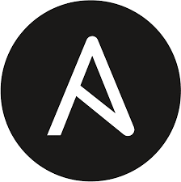

### 
Hi 👋, I’m H4MSK1 (Moe)
  
  

- 💼 I’m a passionate fullstack developer from Sweden.
- 🌱 I’m currently learning data science and Google Cloud professional certifications.

 

## A selection of My Skill Set  
<table><tr><td valign="top" width="33%">

### Frontend  

  
  
  
  
  
  
  
  
  

</td><td valign="top" width="33%">

### Backend  

  
  
  
  
  
  
  
  
  
  
  
  
  
 
  
  

</td><td valign="top" width="33%">

### DevOps  

  
  
  
  
  
  
  
  
  
  
  
  

</td></tr></table>  
